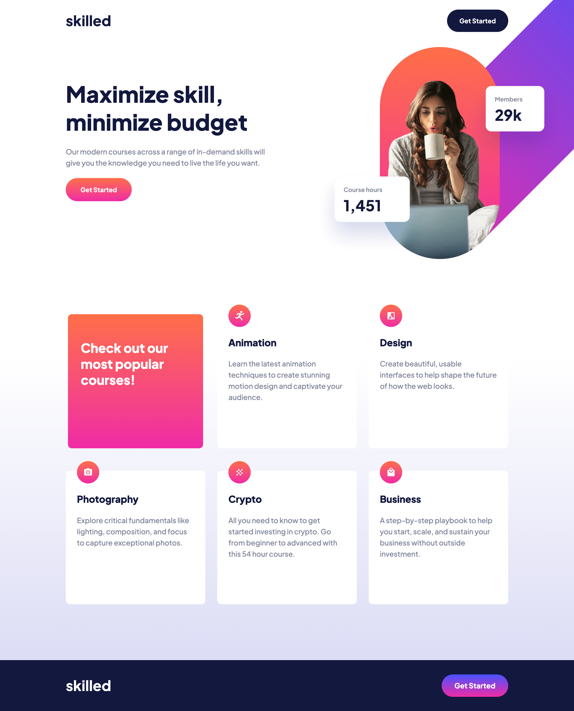
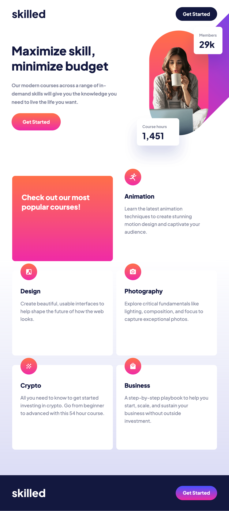
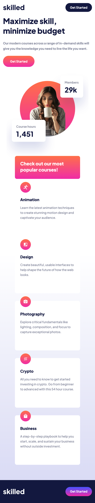

# Frontend Mentor - Skilled e-learning landing page solution

This is a solution to the [Skilled e-learning landing page challenge on Frontend Mentor](https://www.frontendmentor.io/challenges/skilled-elearning-landing-page-S1ObDrZ8q).

## Table of contents

- [Overview](#overview)
  - [The challenge](#the-challenge)
  - [Screenshot](#screenshot)
  - [Links](#links)
- [My process](#my-process)
  - [Built with](#built-with)
- [Author](#author)

## Overview

### The challenge

Users should be able to:

- View the optimal layout depending on their device's screen size
- See hover states for interactive elements

### Screenshot

### Links

- Solution URL: [Click here](https://www.frontendmentor.io/solutions/responsive-landing-page-using-css-grid-1985LRGhBS)
- Live Site URL: [Click here](https://lucky-douhua-995b7c.netlify.app/)

### Built with

- Semantic HTML5 markup
- CSS custom properties
- Flexbox
- CSS Grid
- Mobile-first workflow
- Sass/Scss

## Author

- Website - [Luke Lai](https://lukelai.tech/)
- Frontend Mentor - [@SimpleLuke](https://www.frontendmentor.io/profile/SimpleLuke)
- Twitter - [@LukeLaiDev](https://www.twitter.com/LukeLaiDev)

